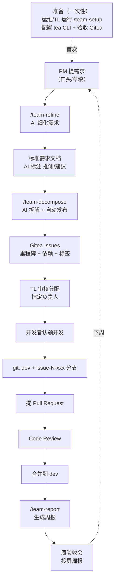

# 团队协作工作流指南

> 本文档面向**人类团队成员**：说明推荐工作流、角色分工、使用举例。
> AI agent 的安装与调用说明见 [README.md](./README.md)。

## 一、整体流程

## 二、推荐工作流（按时间线）

### 准备（一次性）
团队首次接入时，运维或 TL 运行一次 `/team-setup`：配置 tea CLI、连通内网 Gitea、验收 Issue 读写权限。

### 每个需求周期
| 步骤 | 谁 | 做什么 |
|------|-----|--------|
| 1 | PM | `/team-refine 需求描述` → AI 细化成标准需求文档，PM 确认 `[推测]`/`[建议]` 项 |
| 2 | PM | `/team-decompose 需求文档` → AI 拆成任务，**TL 在分配环节指定负责人**，确认后自动发布 Gitea Issue（含里程碑/标签/依赖）|
| 3 | 开发者 | 认领自己的 issue，按 Git Flow 开发：`dev` 主线 + `issue-N-xxx` 分支 → 提 PR → Code Review → 合并 |
| 4 | PM/TL | 每周 `/team-report` → 生成周报（完成率/成员工作量/阻塞/未认领）|

### 每周验收会
会前跑 `/team-report` 生成周报 → 会议投屏 → 跳过"汇报进度"，直接讨论阻塞 + 演示 → 会后把决定追加到周报。

## 三、角色 × 技能

| 角色 | 用哪个技能 | 何时 | 怎么用 |
|------|-----------|------|--------|
| 运维 / TL | `team-setup` | 团队首次接入 | `/team-setup`，引导配置 tea + 验收 |
| **PM（轮值）** | `team-refine` | 拿到新需求时 | `/team-refine 需求描述`，确认 AI 推测 |
| **PM（轮值）** | `team-decompose` | refine 之后 | `/team-decompose 需求文档`，触发拆解 |
| **TL** | `team-decompose`（分配环节）| decompose 流程中 | 审核任务拆解、指定负责人、批准发布 |
| 开发者 | （认领 issue，Git Flow）| 每周期 | 看指派给自己的 issue，开发 + PR |
| PM / TL | `team-report` | 每周验收会前 | `/team-report`，生成周报 |

> **PM 轮值**：PM 角色每周/每需求轮换，靠统一的 `team-refine`/`team-decompose` 技能保证拆解质量一致，不依赖某个人。

## 四、举例：5 人团队一周协作

**成员**：张三（本周 PM 轮值）、李四（TL）、王五（后端）、赵六（前端）、钱七（全栈）
**本周需求**：实现「用户登录」

**周一上午**
- 张三拿到口头需求"做个登录"，跑 `/team-refine 我们要用户登录，用户名密码，记住我`
- AI 提问（登录方式 / 记住我 / 找回密码），张三回答，产出需求文档，确认 `[推测]` 项

**周一下午**
- 张三跑 `/team-decompose 用户登录需求.md`
- AI 拆成 3 任务：① 设计用户表（backend）② 登录 API（backend）③ 登录页（frontend），带依赖
- **李四（TL）审核**：认可拆解，分配 ①② → 王五、③ → 赵六，确认发布
- Gitea 自动建 3 个 Issue（标签 backend/frontend、里程碑「用户登录」、依赖关系），王五/赵六收到通知

**周二–周四**
- 王五从 `dev` 拉 `issue-1-user-table`、`issue-2-login-api` 分支开发，赵六拉 `issue-3-login-page`
- 各自提 PR，李四 Code Review，合并回 `dev`

**周五验收会前**
- 张三跑 `/team-report`：周报显示用户登录完成率 67%（2/3）、王五完成 2、赵六完成 1、无阻塞
- **验收会**：投屏周报，5 分钟过完进度，直接演示 + 讨论下周

**下周**：PM 轮值到赵六，循环。

## 五、Git Flow 约定

- `dev`：开发主线
- `issue-N-xxx`：每个 issue 一个分支（N = issue 号，xxx = 简述）
- PR：`issue-N-xxx` → `dev`，合并后验收
- 发布：`dev` → `main`（TL 负责）

## 六、任务依赖与阻塞

`team-decompose` 发布时自动建立 Gitea 原生依赖（A 依赖 B）。`team-report` 识别"依赖了未完成任务"的阻塞项，周报醒目标注——让 TL 知道哪些任务卡在等谁。

## 七、常见问题

**Q：PM 不会写需求？** `/team-refine` 接受口头/一句话描述，AI 提问补全 + 标注推测，PM 只需确认。

**Q：拆解不合适？** `/team-decompose` 有审核环节（展示任务表 → TL 调整 → 确认才发布），不直接发布错误拆解。

**Q：开发者怎么知道自己的任务？** 看 Gitea 上指派给自己的 Issue（发布时 TL 已指定）。

**Q：周报数据准吗？** 完全来自 Gitea（Issue 状态/assignee/PR/依赖），`/team-report` 不编造数字。
